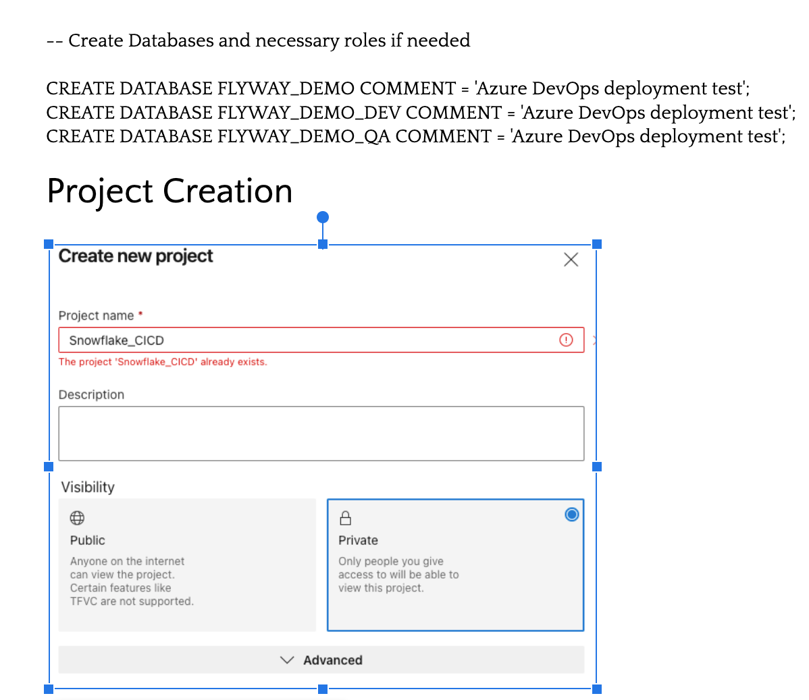
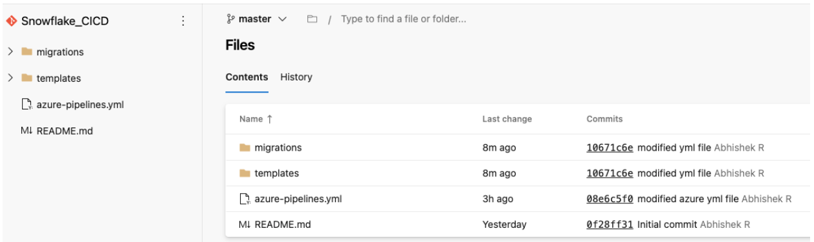
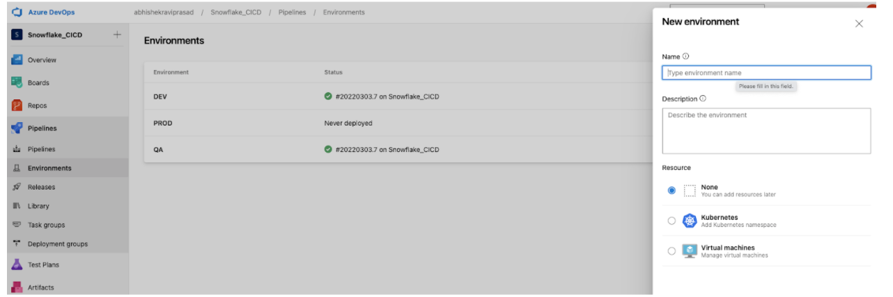
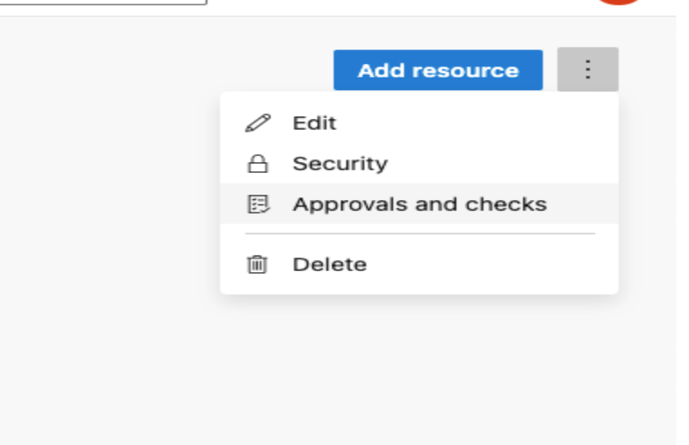
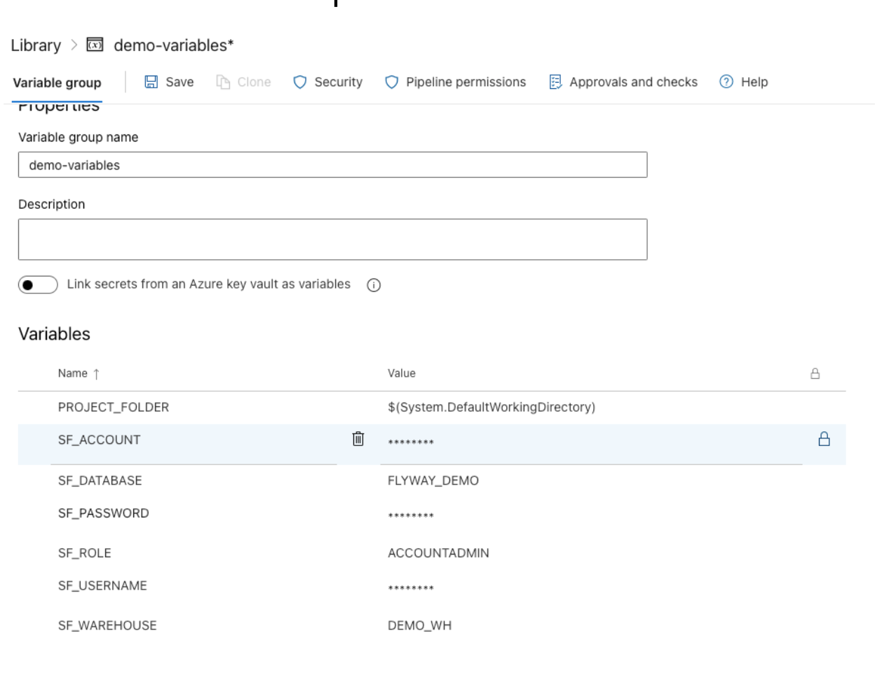
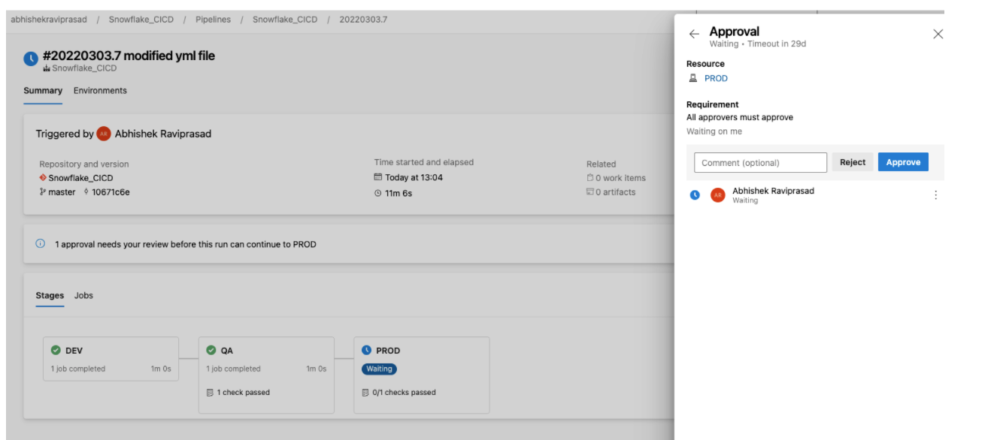

# Snowflake CICD using Azure Devops

 
# Setup Snowflake and Project Creation

# Create Repo and add necessary files and folders

Github link: https://github.com/abhr1994/Snowflake_CICD.git

# Create Environments for Deployment and add necessary approvals

# Create Variable Group

# Result

# References

1. https://community.snowflake.com/s/article/Snowflake-CI-CD-using-Flyway-and-Azure-DevOps-Pipeline-Part-1
2. https://jeremiahhansen.medium.com/building-snowflake-ci-cd-pipelines-with-azure-devops-and-snowchange-c9fe19ea7d67
3. https://medium.com/snowflake/building-ci-cd-pipelines-for-data-applications-at-snowflake-702f398ec7c1

*Notes:*

1. Snowflake CICD can also be done using the following combination,
2. Sqitch + SnowSQL + jenkins or Github actions
3. https://sqitch.org/docs/manual/sqitchtutorial-snowflake/
4. https://github.com/sqlfluff/sqlfluff to validate the sql in test phase
5. https://pypi.org/project/pylint/ ⇒ Python static code analysis tool which looks for programming errors, helps enforcing a coding standard, sniffs for code smells and offers simple refactoring suggestions.
